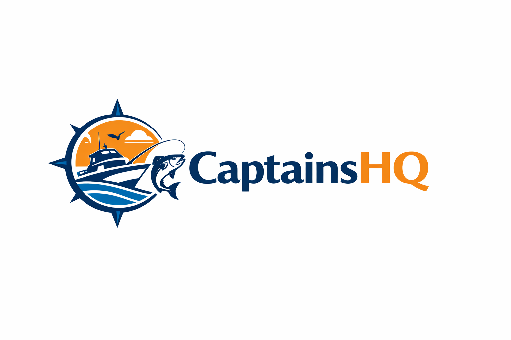
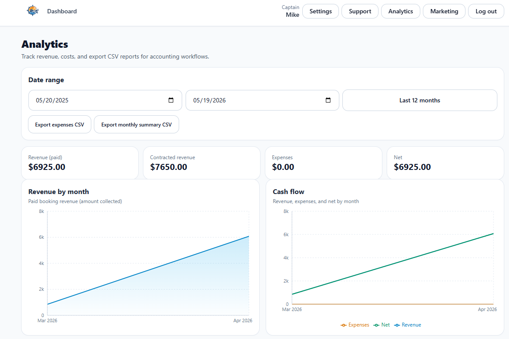
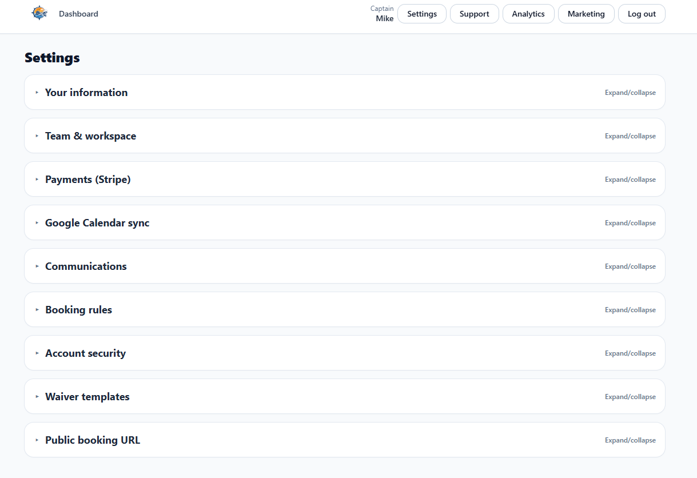
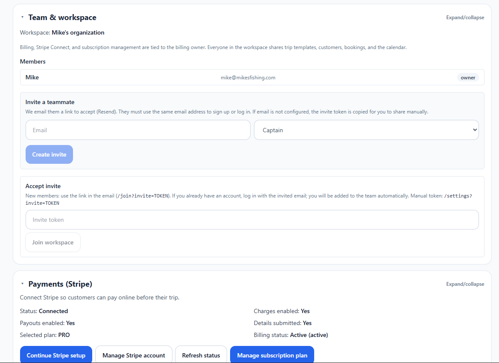
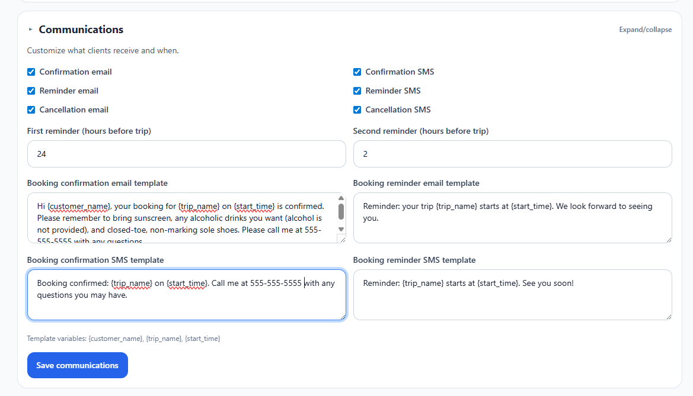
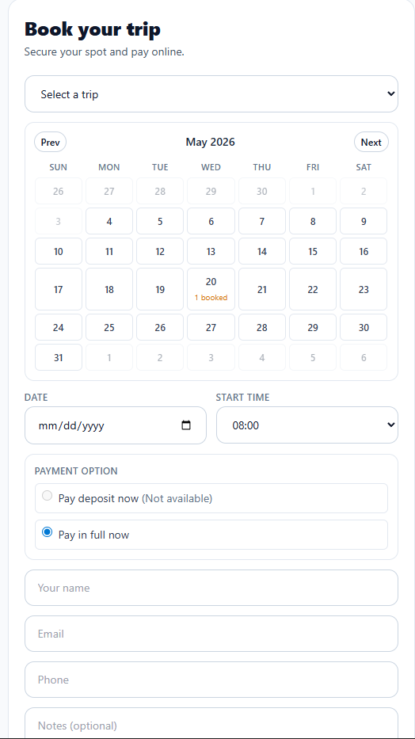
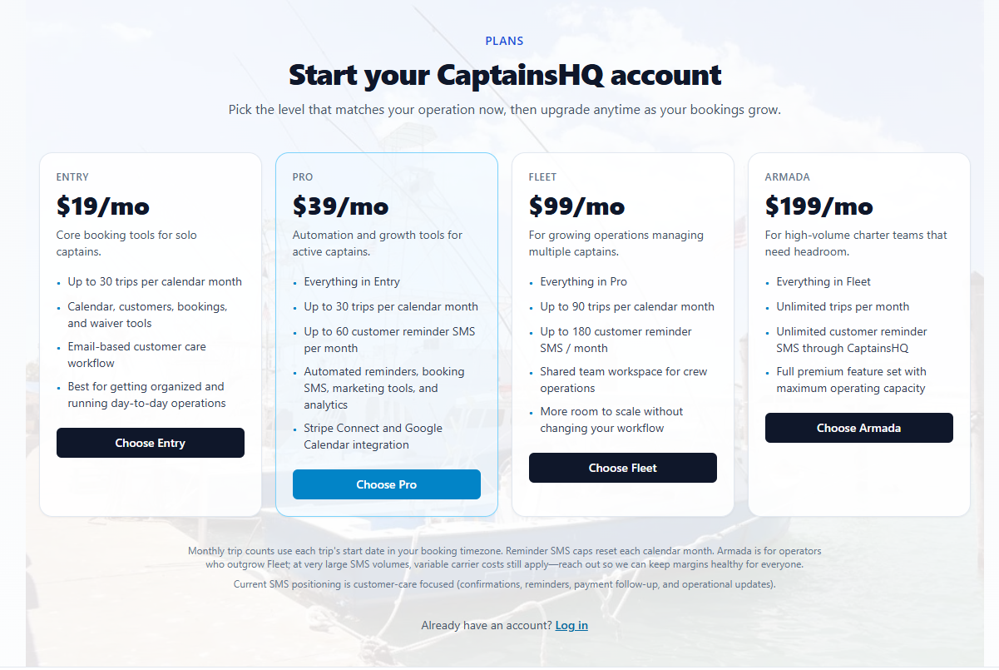
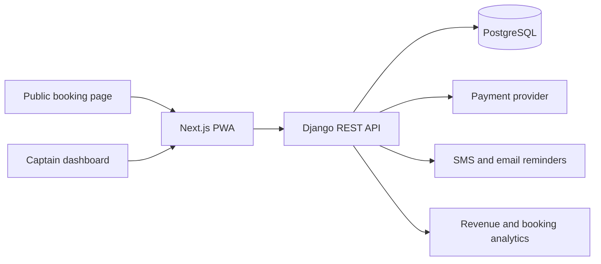

# CaptainsHQ SaaS 

CaptainsHQ is a CRM and operations platform for charter captains. It centralizes booking flows, customer management, automated reminders, revenue and cost tracking, analytics, communications, and public booking workflows.

This repository presents the product, architecture, and workflow design behind CaptainsHQ.

## Product Focus

- CRM for fishing charter captains and small marine service businesses.
- Automated reminders for captains and clients.
- Revenue, cost, and cash-flow analytics.
- Customer management and booking workflows.
- Public trip booking flow designed for mobile users.
- Workspace, communication, and team-oriented settings.

## Product Screenshots

| Analytics dashboard | Workspace settings |
| --- | --- |
|  |  |

| Team workspace | Communications | Public booking |
| --- | --- | --- |
|  |  |  |

| Pricing and packaging |
| --- |
|  |

## Architecture Summary

## Stack

- Django REST Framework.
- PostgreSQL.
- Next.js with TypeScript.
- Tailwind CSS.
- React Query.
- Stripe.
- Twilio/SMS and email integrations.
- Vercel and Cloud Run style deployment.
